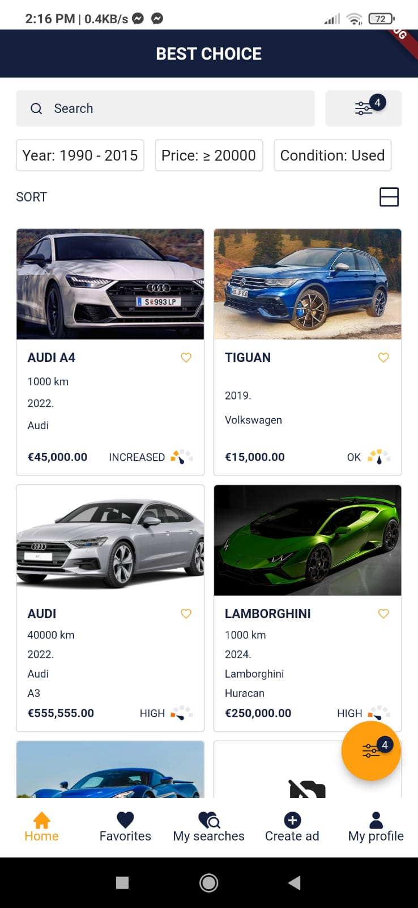

# MojAuto mobile app

## Concepts
- Dart/Flutter 
- Database: GraphQL + Artemis code generator (https://pub.dev/packages/graphql_flutter + https://pub.dev/packages/artemis)
- State management & component lifecycle: Flutter hooks (https://pub.dev/packages/flutter_hooks)
- Authentication & authorization: Keycloak (https://pub.dev/packages/oauth2)
- Localization & internationalization (https://pub.dev/packages/localization + https://pub.dev/packages/i18next)

## Functionalities implemented
- Searching and sorting vehicles using filters (All filters are generated dynamically based on GraphQL data and JSON file that contains information about filter type, data type, etc.)
- Saving chosen filters to saved searches
- Adding ads to favorites
- Comparing multiple ads
- Creating a new add

## Screenshots
Homepage (grid and listview):

  

Profile dashboard:

Ad details:

